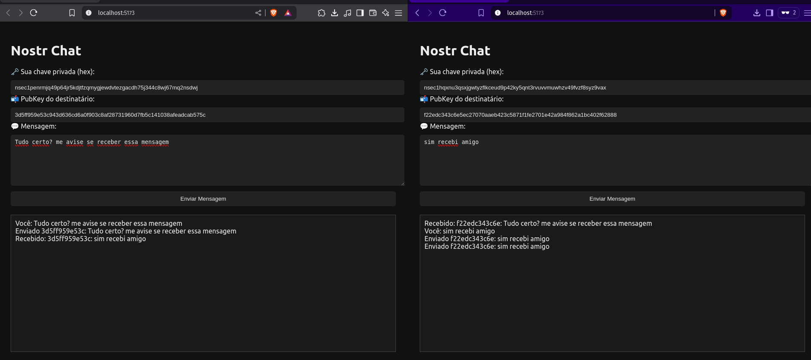

# Nostr Chat app

JS Chat app using Nostr protocol



## Features
- ⚠️⚠️⚠️ ALERT: Please not use your real NSEC/NPUB/Hex key, use a test key. You can generate a test key using the Nostr key generator.
- site to generate Nostr keys: https://nstart.me/en
- Set Your NSEC key
- Set the Hex/NPUB key who you want to send messages
- Conect with Nostr relays
- Send messages
- Receive messages
- Show messages in a chat list

## What I Learned
- How to use Nostr protocol
- How to use Nostr relays
- How to use Nostr keys
- How to use Nostr events
- Vite for building a simple js app
- How to use Nostr library

## Requirements
- Node.js
- NPM

## How to run

1. Clone the repository

```bash
git clone https://github.com/epcgrs/100daysofcode.git
cd 100daysofcode
cd 4
```

2. Run the server in php

```bash
npm install
npm run dev
```

3. Open your browser and go to `http://localhost:5173/` to see the app in action.

4. Set a NSEC key in the input field and click on the button to set the key. ⚠️⚠️⚠️ ALERT: Please not use your real NSEC key, use a test key. You can generate a test key using the Nostr key generator.

5. Set the Hex/NPUB key who you want to send messages a second nostr key in the input field and click on the button to set the key. ⚠️⚠️⚠️ ALERT: Please not use your real Hex/NPUB key, use a test key. You can generate a test key using the Nostr key generator.

6. Send a message to the second nostr key in the input field and click on the button to send the message.

